# ValuePick — ERD 설계도

`valuepick/src/main/java/com/example/demo/domain/entity/` 하위 22개 엔티티 클래스를 실제로 전부 읽고 확인한 뒤 작성한 문서입니다. `README2.md`의 ERD 섹션이 핵심 엔티티만 축약해서 보여준다면, 이 문서는 컬럼 단위까지 전부 담은 상세판입니다.

## 목차

- [전체 ERD](#전체-erd)
- [테이블별 상세](#테이블별-상세)
- [설계 특이사항](#설계-특이사항)

## 전체 ERD

```mermaid
erDiagram
    COMPANY ||--o{ FINANCIAL_STATEMENT : "재무제표 보유"
    COMPANY ||--o{ STOCK_PRICE : "일별 주가 보유"
    COMPANY ||--o| STOCK_INDICATOR : "투자지표 보유"
    COMPANY ||--o{ DIVIDEND_INFO : "배당정보 보유"
    COMPANY ||--o{ TOP100 : "TOP100 이력 보유"
    COMPANY ||--o{ USER_FAVORITE : "관심종목으로 등록됨"

    USER ||--o{ USER_FAVORITE : "관심종목 등록"
    USER ||--o{ INVESTMENT_JOURNAL : "투자일지 작성"
    USER ||--o{ INVESTMENT_POSITION : "포지션 보유"
    USER ||--o{ INVESTMENT_BUY : "매수 기록"
    USER ||--o{ INVESTMENT_SELL : "매도 기록"
    USER ||--o{ COMMENT : "댓글 작성"

    INVESTMENT_JOURNAL ||--o{ COMMENT : "댓글 보유"
    INVESTMENT_POSITION ||--o{ INVESTMENT_BUY : "매수 내역 보유"
    INVESTMENT_POSITION ||--o{ INVESTMENT_SELL : "매도 내역 보유"

    COMPANY {
        string stock_code PK
        string corp_code UK
        string corp_name
        string corp_cls "CHAR(1), 코스피/코스닥 구분"
        string induty_code "표준산업분류코드(DART)"
        string induty_nm "KSIC 중분류 매핑명"
        string ceo_nm
        datetime created_at
        datetime updated_at
    }

    FINANCIAL_STATEMENT {
        long id PK
        string bsns_year "CHAR(4)"
        string stock_code FK
        string reprt_code "CHAR(5)"
        string fs_div "CHAR(3), CFS/OFS"
        long revenue
        long operating_income
        long net_income
        long total_assets
        long total_liabilities
        long total_equity
        long current_assets
        long current_liabilities
        long operating_cash_flow
        long gross_profit
        string currency
    }

    STOCK_PRICE {
        string srtn_cd PK "FK, company.stock_code (읽기전용)"
        date bas_dt PK
        long clpr
        long lstg_st_cnt
        long mrkt_tot_amt
        long mkp
        double flt_rt
        datetime created_at
        datetime updated_at
    }

    STOCK_INDICATOR {
        string stock_code PK "FK (읽기전용)"
        double per
        double pbr
        double roe
        double debt_ratio
        double dividend_yield
        double eps
        double bps
        double roa
        double momentum
        int f_score
        double eps_growth_rate
        datetime calculated_at
    }

    DIVIDEND_INFO {
        string corp_code PK "FK, company.corp_code (읽기전용)"
        string dividend_kind PK
        long dividend_amount
        datetime stlm_dt
    }

    TOP100 {
        date base_dt PK
        string stock_code PK "FK (읽기전용)"
        string corp_code "비정규화 컬럼, FK 아님"
        double score
    }

    USER_FAVORITE {
        long user_id PK "FK, ON DELETE CASCADE (읽기전용)"
        string stock_code PK "FK (읽기전용)"
        datetime created_at
        datetime updated_at
    }

    USER {
        long id PK
        string email UK
        string password
        string nickname
        string role "enum: USER, ADMIN"
        string provider
        string provider_id
        datetime created_at
        datetime updated_at
        datetime deleted_at "soft delete"
    }

    INVESTMENT_JOURNAL {
        long id PK
        long user_id FK "ON DELETE CASCADE"
        string title
        text content
        datetime created_at
        datetime updated_at
    }

    INVESTMENT_POSITION {
        long id PK
        long user_id FK "ON DELETE CASCADE"
        string title
        string stock_code
        string corp_name
        datetime first_buy_at
        datetime final_sell_at
        text note
        boolean is_shared
        string state "enum: 보유, 완료"
        datetime created_at
    }

    INVESTMENT_BUY {
        long id PK
        long user_id FK "ON DELETE CASCADE"
        long position_id FK
        string stock_code
        string corp_name
        datetime buy_at
        long price
        int quantity
        boolean is_shared
        datetime created_at
    }

    INVESTMENT_SELL {
        long id PK
        long user_id FK "ON DELETE CASCADE"
        long position_id FK
        string stock_code
        string corp_name
        datetime sell_at
        long price
        int quantity
        boolean is_shared
        datetime created_at
    }

    COMMENT {
        long id PK
        long journal_id FK "ON DELETE CASCADE"
        long user_id FK "ON DELETE CASCADE"
        text content
        datetime created_at
        datetime updated_at
    }

    EXCHANGE {
        string curUnit PK "통화코드"
        date baseDate
        string country
        double dealBasR
        double changeRate
        double changeAmount
    }

    MARKET_INDEX {
        long id PK
        date basDd
        string idxNm
        double flucRt
        double opnprcIdx
        double clsprcIdx
        double cmpprevddIdx
        long mktcap
    }

    NEWS {
        long id PK
        string stock_code "FK 아님, 순수 문자열 컬럼"
        string office_id
        string article_id
        string title
        string press
        string link
        datetime published_at
        datetime created_at
    }

    REFRESH_TOKEN {
        long id PK
        string email UK "User.email과 문자열로만 연결, JPA 연관관계 없음"
        string token
        datetime expiresAt
    }
```

## 테이블별 상세

### 종목/시세/재무 도메인

- **COMPANY**: `stock_code`가 PK, `corp_code`는 UK. DART 기업코드와 상장코드를 모두 갖고 있어 다른 엔티티들이 둘 중 하나를 골라 참조합니다.
- **FINANCIAL_STATEMENT**: `(bsns_year, stock_code, reprt_code, fs_div)` 유니크 제약으로 동일 연도·보고서·재무제표 구분의 중복 저장을 막습니다([FinancialStatement.java:7-8](valuepick/src/main/java/com/example/demo/domain/entity/FinancialStatement.java#L7-L8)). `company`는 일반 `@ManyToOne` + `@JoinColumn(stock_code)`로, 값을 쓰고 읽는 정상적인 FK입니다.
- **STOCK_PRICE**: `(srtn_cd, bas_dt)` 복합키(`@IdClass StockPriceId`). `company` 연관관계는 `@JoinColumn(name="srtn_cd", referencedColumnName="stock_code", insertable=false, updatable=false)`라서 조회 전용이고, 실제 값 저장은 `srtn_cd` 컬럼 자체를 통해 이루어집니다([StockPrice.java:25-27](valuepick/src/main/java/com/example/demo/domain/entity/StockPrice.java#L25-L27)).
- **STOCK_INDICATOR**: `Company`와 `@OneToOne` 관계이며 PK를 `stock_code`로 공유합니다.
- **DIVIDEND_INFO**: PK가 `(corp_code, dividend_kind)`인데, 다른 종목 관련 테이블들과 달리 `stock_code`가 아니라 `corp_code`로 `Company`를 참조합니다([DividendInfo.java:20-22](valuepick/src/main/java/com/example/demo/domain/entity/DividendInfo.java#L20-L22)). DART 배당 API가 `corp_code` 기준으로 데이터를 주기 때문입니다.
- **TOP100**: PK가 `(base_dt, stock_code)`라 종목별 날짜별 스코어 이력이 전부 쌓입니다. `corp_code` 컬럼은 FK가 아니라 조회 편의를 위한 비정규화 컬럼입니다.

### 사용자/인증 도메인

- **USER**: `role`은 `UserRole` enum(`USER`, `ADMIN`), `deleted_at`으로 소프트 삭제를 구현합니다([User.java:48-54](valuepick/src/main/java/com/example/demo/domain/entity/User.java#L48-L54)).
- **REFRESH_TOKEN**: `User`와 JPA 연관관계 자체가 없습니다. `email` 문자열 값으로만 매칭되는 완전히 독립된 테이블입니다([RefreshToken.java](valuepick/src/main/java/com/example/demo/domain/entity/RefreshToken.java)).
- **USER_FAVORITE**: PK가 `(user_id, stock_code)` 복합키. `user`, `company` 연관관계 둘 다 `insertable=false, updatable=false` 조회 전용 매핑이며, `user` 쪽에는 추가로 `@OnDelete(CASCADE)`가 붙어 있어 회원 탈퇴 시 DB 레벨에서 즉시 삭제됩니다([UserFavorite.java:26-33](valuepick/src/main/java/com/example/demo/domain/entity/UserFavorite.java#L26-L33)).

### 투자일지 도메인

- **INVESTMENT_JOURNAL / COMMENT**: 일지 하나에 댓글 여러 개, 댓글은 작성자(`User`)와 소속 일지(`InvestmentJournal`) 둘 다 `@OnDelete(CASCADE)`.
- **INVESTMENT_POSITION**: `state`가 `JournalState` enum(`보유`, `완료`)으로 관리되고, `complete()`/`reopen()` 메서드로 상태 전환과 `final_sell_at` 갱신이 함께 일어납니다([InvestmentPosition.java:59-67](valuepick/src/main/java/com/example/demo/domain/entity/InvestmentPosition.java#L59-L67)).
- **INVESTMENT_BUY / INVESTMENT_SELL**: 각각 `position_id`로 하나의 포지션에 종속되고, `stock_code`·`corp_name`은 조회 편의를 위해 포지션과 별개로 다시 저장되어 있습니다(비정규화).

### 독립 테이블 (JPA 연관관계 없음)

`EXCHANGE`, `MARKET_INDEX`, `NEWS`는 다른 엔티티와 JPA 매핑이 전혀 없는 독립 테이블입니다. `NEWS.stock_code`도 FK가 아니라 순수 문자열 컬럼입니다.

## 설계 특이사항

1. **자연키(natural key) 기반 읽기 전용 연관관계가 많다.** `StockPrice`, `StockIndicator`, `DividendInfo`, `Top100`, `UserFavorite`의 `company`/`user` 연관관계는 전부 `insertable=false, updatable=false`로 선언되어 있습니다. 즉 실제 INSERT/UPDATE는 `@Id` 컬럼(예: `srtn_cd`, `corp_code`, `stock_code`, `user_id`)을 통해서만 이루어지고, 연관관계 필드는 조회(JOIN)용으로만 씁니다. `Top100Service`에서 N+1을 막기 위해 `JOIN FETCH`를 쓴 이유도 이 구조 때문입니다(자세한 내용은 `README2.md` 참고).
2. **`Company`를 참조하는 키가 통일되어 있지 않다.** 대부분은 `stock_code`로 참조하지만 `DIVIDEND_INFO`만 `corp_code`로 참조합니다. DART 배당 정보 API 응답이 `corp_code` 기준이라 그대로 반영된 결과입니다.
3. **복합키 엔티티는 전부 `@IdClass`를 쓴다.** `StockPrice`, `DividendInfo`, `Top100`, `UserFavorite` 네 곳 모두 별도의 `*Id` Serializable 클래스(`StockPriceId`, `DividendInfoId`, `Top100Id`, `UserFavoriteId`)를 사용합니다.
4. **비정규화 컬럼이 의도적으로 존재한다.** `Top100.corp_code`, `InvestmentPosition/Buy/Sell.stock_code`·`corp_name`은 정규화하면 조인으로 구할 수 있는 값이지만, 조회 성능과 이력 보존(종목명이 바뀌어도 당시 기록 유지) 목적으로 중복 저장되어 있습니다.
5. **`REFRESH_TOKEN`은 의도적으로 `User`와 FK로 묶여 있지 않다.** `email` 문자열만으로 연결되는 독립 테이블입니다.
