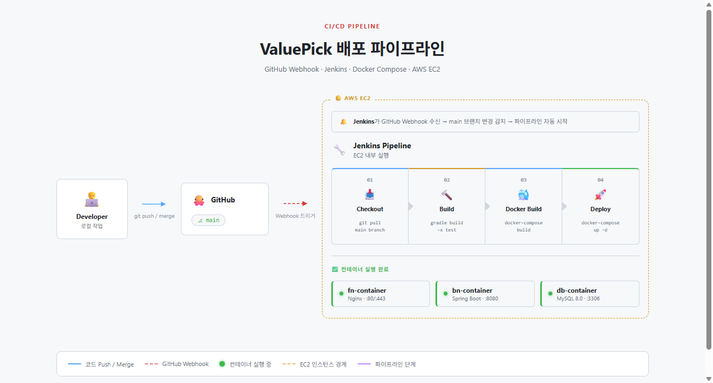
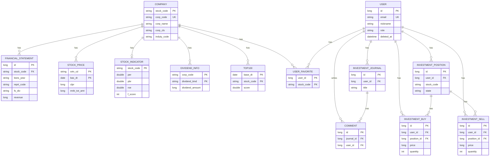

# ValuePick

가치투자 지표 기반 종목 스크리닝 서비스. DART 재무제표, 공공데이터포털 주가, KRX 지수, 한국수출입은행 환율을 매일 자동 수집해 PER·PBR·ROE·Piotroski F-Score 등 투자지표를 계산하고, 다팩터 가중 스코어링으로 저평가 우량주 TOP100을 추천합니다. 개인 투자일지(매수/매도 기록, 손익 관리) 기능을 함께 제공합니다.

- 서비스 주소: https://www.valuepick.cloud
- 배포 상태: 1차 배포 완료

## 목차

- [아키텍처 설계도](#아키텍처-설계도)
- [ERD](#erd)
- [기술 스택](#기술-스택)
- [주요 기능](#주요-기능)
- [폴더 구조](#폴더-구조)
- [데이터 파이프라인](#데이터-파이프라인)
- [API 개요](#api-개요)
- [트러블슈팅 / 기술적 의사결정](#트러블슈팅--기술적-의사결정)
- [실행 방법](#실행-방법)
- [팀원 구성](#팀원-구성)
- [1차 배포 범위](#1차-배포-범위)
- [개선사항](#개선사항)

## 아키텍처 설계도

### 시스템 아키텍처


상세 이미지 : [링크](https://project-valuepick.github.io/valuepick/시스템%20아키텍쳐.html)


### 기술 아키텍처


상세 이미지 : [링크](https://project-valuepick.github.io/valuepick/기술%20아키텍쳐.html)

### CI/CD 파이프 라인



상세 이미지 : [링크](https://project-valuepick.github.io/valuepick/배포%20파이프라인.html)


## ERD

핵심 엔티티 관계입니다. `MARKET_INDEX`, `EXCHANGE`, `NEWS`는 다른 엔티티와 JPA 연관관계로 매핑돼 있지 않은 독립 테이블이라 다이어그램에서는 제외했습니다(`NEWS.stock_code`는 FK가 아닌 단순 컬럼). `RefreshToken`도 `email` 문자열로만 연결되고 `User`와 FK 매핑은 없습니다.

> 상세 문서: [`ERD.md`](docs/ERD.md) · 시각화: [바로 보기](https://project-valuepick.github.io/valuepick/erd.html) 


## 기술 스택
<div style="margin: 0 auto; text-align: center;" align="center">

<b>Backend</b><br/>


<br/><br/>

<b>Frontend</b><br/>


<br/><br/>

<b>Infra</b><br/>


</div>


## 주요 기능

### 종목 스크리닝
- 전체 종목 목록 조회 · PER/PBR/ROE/배당수익률 범위 필터 · 정렬 · 페이징 · 종목명 검색

  

- 종목 상세: 재무제표(손익계산서·재무상태표) 연도별 추이, 투자지표, 관련 뉴스, Canvas 차트

  

- 홈 화면: 코스피 지수·환율 위젯, TOP10 추천 종목, 4대 랭킹(저PER/저PBR/고ROE/고배당) — 10초 주기 실시간 시세 갱신

  

- TOP100 랭킹: Piotroski F-Score + 7개 팩터 가중 스코어링 결과 페이지

  

### 투자지표 스코어링 엔진
- **투자지표 계산**: EPS·BPS·PER·PBR·ROE·ROA·부채비율·배당수익률·모멘텀(12-1)·EPS성장률, 외화 재무제표는 환율 환산 후 계산
- **Piotroski F-Score(0~9점)**: 수익성 4 + 재무건전성 3 + 운영효율성 2 항목, 금융업은 구조상 제외 처리
- **TOP100 스코어**: F-Score 6점 이상 통과 종목만 후보로, PER 25% · ROE 20% · PBR·부채비율 15% · ROA·모멘텀 10% · EPS성장률 5% 가중치로 백분위 정규화 후 합산

### 회원/인증
- JWT(Access/Refresh) 기반 회원가입·로그인·토큰 재발급

  

- 마이페이지: 닉네임/비밀번호 변경, 관심종목 관리, 회원탈퇴(soft delete, 30일 유예 후 스케줄러가 완전 삭제)

  

- 관심종목 등록/해제

  

### 투자일지
- 종목별 매수/매도 기록, 보유/완료 상태 관리, 메모, 제목 수정, 공유 여부 토글
- 카테고리·기간·검색 조건 페이징 조회

  

## 폴더 구조

```
invest-project/
├── valuepick/                  # Spring Boot 백엔드
│   └── src/main/java/com/example/demo/
│       ├── config/             # Security, JWT, CORS, WebMvc 설정
│       ├── domain/
│       │   ├── controller/     # REST 컨트롤러
│       │   ├── service/        # 비즈니스 로직 (지표계산, 스코어링, 수집기 등)
│       │   ├── entity/         # JPA 엔티티
│       │   ├── repository/     # Spring Data JPA 리포지토리
│       │   ├── dto/            # 요청/응답 DTO
│       │   └── scheduled/      # 배치 스케줄러
│       └── global/exception/   # 전역 예외 처리
├── front/                       # 정적 프론트엔드 (MPA)
│   ├── *.html                  # 페이지별 HTML
│   ├── js/                     # 페이지별 JS
│   ├── css/                    # 페이지별 CSS
│   └── nginx.conf              # 운영용 Nginx 설정
├── DB/                          # MySQL Dockerfile
├── docker-compose.yml           # 운영 배포 구성
└── docker-compose-local.yml     # 로컬 개발 구성
```

## 데이터 파이프라인

매일 새벽(Asia/Seoul 기준) 배치가 순차 실행되어 최신 데이터를 반영합니다.

| 시각 | 스케줄러 | 작업 |
|---|---|---|
| 01:00 (평일) | ExchangeScheduler | 환율 수집 |
| 01:10 (평일) | MarketIndexScheduler | 코스피 지수 수집 |
| 01:20 (평일) | StockPriceScheduler | 주가 수집 |
| 01:50 (평일) | IndicatorScheduler | 투자지표 계산 (PER/PBR/ROE/F-Score/모멘텀 등) |
| 02:00 (평일) | Top100Scheduler | TOP100 스코어 계산 |
| 02:30~02:35 | 각 스케줄러 | 7일 이전 시세/지수/환율/TOP100 데이터 정리 |
| 매시 정각 | NewsScheduler | 종목별 뉴스 수집 |
| 매년 1월 1일 | CompanyScheduler | 기업정보(DART) 수집 |
| 매년 4월 1일 | FinancialScheduler / DividendScheduler | 사업보고서·배당 정보 수집 |
| 매일 자정 | UserCleanupScheduler | 탈퇴 30일 경과 유저 완전 삭제 |

## API 개요

| 경로 | 설명 | 로그인 필요 여부 |
|---|---|---|
| `POST /api/auth/register`, `/login`, `/refresh` | 회원가입 · 로그인 · 토큰 재발급 | 불필요 (로그인 이전 단계이므로) |
| `GET /info/**` | 종목 목록/필터/검색/랭킹/TOP10·100/지수/환율 조회 | 불필요 |
| `GET /api/stocks/**` | 종목 상세/뉴스/검색/재무제표 조회 | 불필요 |
| `/api/favorites/**` | 관심종목 등록/조회/해제 | **필요** |
| `/api/journal/**` | 투자일지 CRUD | **필요** |
| `/api/users/me/**` | 마이페이지 (내 정보, 닉네임/비밀번호 변경, 탈퇴) | **필요** |
| `/admin/**`, `/company/**`, `/api/admin/**`, `/api/top100/admin/**` | 데이터 수집 트리거, TOP100 수동 재계산 등 관리자 작업 | **필요 (ADMIN 권한)** |

## 트러블슈팅 / 기술적 의사결정

개발하면서 실제로 부딪힌 문제와, 그걸 왜 이런 방식으로 풀었는지를 정리했습니다.

1. TOP100 스코어링의 N+1 방지
2. DART 수집 전용 `@Async` 스레드풀
3. TOP100 스코어 — 원값이 아닌 백분위 순위로 정규화
4. 금융업 F-Score 예외 처리
5. DART 대량 수집 — 페이지 배치 + 호출 간격 + 재시도
6. 스케줄러 파이프라인 순서 보장 — cron 분 단위 스태거링
7. 환율 API의 "빈 응답"을 휴일 판별 신호로 재활용
8. 종목명 필터링 — `endsWith`와 `contains`를 법령 근거에 따라 구분
9. JWT 무상태성을 일부 포기하고 회원탈퇴 즉시 반영
10. 투자일지 매수/매도 삭제 시 포지션 상태 재계산

<details>
<summary><b>펼쳐서 자세히 보기</b></summary>

### 1. TOP100 스코어링의 N+1 방지

TOP100 스코어링을 짜면서 `STOCK_INDICATOR` 전체를 스캔하는 동안 각 지표의 `Company`에서 `corpCls`(코스피 여부)·`indutyCode`(금융업 판별)까지 읽어야 했습니다. 그런데 `StockIndicator.company`가 지연 로딩(`FetchType.LAZY`)이라, 그냥 순회하면 지표 건수만큼 `SELECT`가 추가로 나가는 N+1 문제가 생겼습니다. 그래서 [Top100Service.calculateAndSave()](valuepick/src/main/java/com/example/demo/domain/service/Top100Service.java#L38)가 부르는 조회 쿼리를 아예 `JOIN FETCH`로 다시 만들었습니다.

```java
// StockIndicatorRepository
@Query("SELECT i FROM StockIndicator i JOIN FETCH i.company WHERE i.per IS NOT NULL AND i.pbr IS NOT NULL AND i.roe IS NOT NULL")
List<StockIndicator> findAllWithCompanyForScoring();
```

이렇게 하면 `StockIndicator`와 `Company`를 한 번에 로딩해서, 전체 종목을 스코어링 대상으로 순회해도 쿼리는 1번만 나갑니다.

### 2. DART 수집 전용 `@Async` 스레드풀

주가 수집과 DART 수집(재무제표·기업정보·배당)은 호출하는 외부 API 성격과 처리 시간이 완전히 다릅니다. 스레드풀을 하나로 쓰면 한쪽이 오래 걸릴 때 다른 쪽 작업까지 큐에서 밀려 지연될 것 같아서, [AsyncConfig](valuepick/src/main/java/com/example/demo/config/AsyncConfig.java)에 `dartExecutor`(core 8 / max 15 / queue 100)를 따로 만들고 `DartFinancialCollector`([DartFinancialCollector.java:74,80](valuepick/src/main/java/com/example/demo/domain/service/DartFinancialCollector.java#L74)), `DartCompanyCollector`([DartCompanyCollector.java:128](valuepick/src/main/java/com/example/demo/domain/service/DartCompanyCollector.java#L128)), `DividendCollector`([DividendCollector.java:42](valuepick/src/main/java/com/example/demo/domain/service/DividendCollector.java#L42)) 세 곳 모두 `@Async("dartExecutor")`로 붙였습니다. 큐 용량도 100으로 크게 잡아서, 상장사 수천 개를 한 번에 처리해도 작업이 거절되지 않도록 여유를 뒀습니다.

### 3. TOP100 스코어 — 원값이 아닌 백분위 순위로 정규화

PER·PBR·ROE·ROA·부채비율·EPS성장률·모멘텀을 그냥 가중합하려니 문제가 있었습니다. 지표마다 단위와 스케일이 완전히 달라서(PER은 배수, ROE는 %, 모멘텀은 수익률 등) 원값을 그대로 곱하면 스케일이 큰 지표가 점수를 지배해버립니다. 그래서 [Top100Service.scoreAll()](valuepick/src/main/java/com/example/demo/domain/service/Top100Service.java#L121)에서 원값 대신 지표별 오름차순/내림차순 순위(`ascRank`/`descRank`)를 먼저 매기고, `percentileFraction()`으로 0~1 사이 값으로 바꾼 뒤에 가중치를 곱하도록 했습니다.

null 처리도 신경 썼습니다 — 순위 계산 자체가 오염되지 않도록, 낮을수록 유리한 지표(PER/PBR/부채비율)는 `null → Double.MAX_VALUE`, 높을수록 유리한 지표(ROE/ROA/모멘텀/EPS성장률)는 `null → -Double.MAX_VALUE`로 채워서, 값이 없는 종목은 항상 그 지표에서 최하위로 취급되게 만들었습니다.

### 4. 금융업 F-Score 예외 처리

Piotroski F-Score를 전 종목에 그대로 적용하려니 문제가 생겼습니다. F-Score는 유동비율·매출총이익률처럼 제조업 재무구조를 전제로 한 항목이 섞여 있어서 금융업에는 구조적으로 안 맞습니다. 그래서 [Company.isFinancialIndustry()](valuepick/src/main/java/com/example/demo/domain/entity/Company.java#L74)로 `induty_code` 앞 2자리가 64(금융업)/65(보험및연금업)/66(금융및보험관련서비스업)인지 먼저 확인하고, 금융업이면 F-Score를 계산하지 않고 TOP100 필터에서도 F-Score 조건 없이 통과시키도록 했습니다([Top100Service.calculateAndSave()](valuepick/src/main/java/com/example/demo/domain/service/Top100Service.java#L62) 필터 조건 참고).

반대로 `induty_code`가 아직 수집되지 않은 종목은 후보에서 통째로 제외했습니다. 금융업 여부를 모르는 상태로 F-Score 조건을 그대로 적용하면, 진짜 금융업인데 업종코드가 없어서 예외 대상에서 빠지고 구조적으로 부당하게 탈락하는 경우가 생길 수 있기 때문입니다.

### 5. DART 대량 수집 — 페이지 배치 + 호출 간격 + 재시도

DART API로 전체 상장사 재무제표를 수집하다 보니 신경 쓸 게 여럿 있었습니다. [DartFinancialCollector.doCollect()](valuepick/src/main/java/com/example/demo/domain/service/DartFinancialCollector.java#L85)에서 한 번에 다 조회하지 않고 `PAGE_SIZE=100` 단위로 페이징하며 순차 처리했고, 회사 하나 처리할 때마다 `Thread.sleep(100ms)`를 넣어서 DART API를 너무 빠르게 두드리지 않도록 했습니다. CFS(연결재무제표) 조회가 실패하면 OFS(별도재무제표)로 한 번 더 시도하게 했고, HTTP 요청 자체가 실패하는 경우는 `requestWithRetry()`([DartFinancialCollector.java:145-164](valuepick/src/main/java/com/example/demo/domain/service/DartFinancialCollector.java#L145-L164))에서 재시도 간격을 점점 늘려가며(500ms × 시도 횟수, 최대 3회) 다시 요청하도록 했습니다. 이미 저장된 연도 데이터는 `findByStockCodeAndYearAndReprtCode`로 존재 여부를 확인해서 중복 저장을 막았습니다.

### 6. 스케줄러 파이프라인 순서 보장 — cron 분 단위 스태거링

주가 → 지표 계산 → TOP100 스코어링은 앞 단계 결과에 의존하는 순차 파이프라인인데, `@Scheduled`는 각자 독립적으로 트리거되다 보니 순서를 강제할 방법이 마땅치 않았습니다. 그래서 크론의 분(minute) 값을 의도적으로 어긋나게 배치해서 앞 단계가 끝날 시간을 확보하는 방식을 택했습니다: `ExchangeScheduler` 01:00 → `MarketIndexScheduler` 01:10 → `StockPriceScheduler` 01:20 → [IndicatorScheduler](valuepick/src/main/java/com/example/demo/domain/scheduled/IndicatorScheduler.java#L18-20) 01:50(주석: "StockPriceScheduler 수집 완료 후, Top100Scheduler 이전") → `Top100Scheduler` 02:00. 삭제 스케줄러들도 02:30, TOP100 삭제만 02:35로 한 단계 늦춰서 실행되게 했습니다.

같은 파일들에 "전 영업일자 조회" 로직(`LocalDate.now().minusDays(요일==월요일 ? 3 : 1)`)도 반복해서 넣었습니다. 월요일에만 3일을 빼는 이유는 주말을 건너뛰고 직전 영업일(금요일)을 맞추기 위해서입니다.

[IndicatorScheduler.activeYear()](valuepick/src/main/java/com/example/demo/domain/scheduled/IndicatorScheduler.java#L31-36)는 "사업보고서는 매년 4월 1일에 전년도분이 공시되므로, 그 전엔 재작년 데이터가 이후엔 작년 데이터가 최신"이라는 근거로 4월 1일을 기준점 삼아 조회 연도를 나누게 했습니다.

### 7. 환율 API의 "빈 응답"을 휴일 판별 신호로 재활용

한국수출입은행 환율 API를 붙여보니 주말/공휴일에는 별도 플래그 없이 그냥 빈 배열만 돌아왔습니다. 전일 대비 환율 변동률을 계산하려면 "가장 최근 영업일"을 알아야 하는데, 캘린더만으로는 공휴일을 판단할 수 없다는 게 문제였습니다. 그래서 [ExchangeRateApiService.callExchangeApi()](valuepick/src/main/java/com/example/demo/domain/service/ExchangeRateApiService.java#L176-179)에서 응답이 비어있으면 `IllegalStateException`을 던지도록 만들고, [findPreviousBusinessDayRates()](valuepick/src/main/java/com/example/demo/domain/service/ExchangeRateApiService.java#L136-160)에서 이 예외를 캐치해 하루씩 거슬러 올라가며 재탐색하게 했습니다(`MAX_PREVIOUS_DAY_LOOKUP=10`). DB에 이미 저장된 날짜가 있으면 API를 다시 호출하지 않고 재사용하도록 우선순위도 나눴습니다. API 호출 실패 자체를 "이 날짜는 휴일이다"라는 신호로 거꾸로 활용한 셈입니다.

### 8. 종목명 필터링 — `endsWith`와 `contains`를 법령 근거에 따라 구분

리츠·스팩 종목을 상장사 목록에서 걸러내야 했는데, 단순히 `contains`로만 처리하면 "메리츠", "블리츠" 같은 무관한 종목까지 리츠로 오탐될 수 있다는 걸 알게 됐습니다. 그래서 [DartCompanyCollector.isExcludedStock()](valuepick/src/main/java/com/example/demo/domain/service/DartCompanyCollector.java#L351-355)에서 매칭 방식을 법령 근거에 따라 다르게 나눴습니다 — 부동산투자회사법상 리츠는 상호 **끝**에 "리츠"를 붙이도록 강제돼 있어서 `corpName.endsWith("리츠")`로 처리했고, 스팩(기업인수목적회사)은 자본시장법상 상호 어디에든 "스팩"이 반드시 들어가야 해서 `corpName.contains("스팩")`만으로도 충분하다고 판단했습니다.

### 9. JWT 무상태성을 일부 포기하고 회원탈퇴 즉시 반영

JWT AccessToken은 원래 서버가 상태를 안 가져도(stateless) 검증되는 게 장점인데, 회원탈퇴를 소프트 삭제(`User.deletedAt`)로 처리하다 보니 이 장점이 오히려 문제가 됐습니다. AccessToken 검증만 그대로 두면 탈퇴한 계정이 토큰 만료 전까지 계속 API를 쓸 수 있기 때문입니다. 그래서 [JWTTokenProvider.getAuthentication()](valuepick/src/main/java/com/example/demo/config/auth/jwt/JWTTokenProvider.java#L106-108)에서 토큰을 파싱한 뒤에도 매 요청마다 `userRepository.existsByEmailAndDeletedAtIsNull()`을 다시 조회해서, 탈퇴한 유저면 인증을 무효화하도록 했습니다. JWT의 "DB 조회 없이 검증 가능"이라는 이점을 일부 포기하고 탈퇴 즉시 반영을 택한 트레이드오프입니다. 같은 이유로 로그인 시점(`AuthService`)에도 탈퇴 여부를 다시 확인하게 했고, 탈퇴 처리 시 `RefreshToken`도 즉시 삭제하도록 했습니다. `RefreshToken`을 `User`와 FK 없이 `email` 문자열로만 연결한 것도(`RefreshToken.java`), 탈퇴 시 애플리케이션 로직으로 바로 지우고 30일 뒤 하드 삭제 스케줄러가 FK 제약 없이 정리할 수 있게 하려는 의도였습니다.

### 10. 투자일지 매수/매도 삭제 시 포지션 상태 재계산

매수·매도 기록을 사후에 삭제할 수 있게 열어두다 보니, 포지션의 "보유/완료" 상태와 `firstBuyAt`/`finalSellAt`이 실제 남은 기록과 어긋나는 경우를 처리해야 했습니다. 그래서 [InvestmentJournalService.deleteBuy()](valuepick/src/main/java/com/example/demo/domain/service/InvestmentJournalService.java#L312-352)에는 이미 매도된 수량이 삭제하려는 매수 수량보다 많으면 삭제 자체를 막고, 첫 매수 기록을 지우는 경우 `firstBuyAt`을 다음으로 이른 매수일로 갱신하며, 매수 기록이 아예 없어지면 포지션 자체를 삭제하는 로직을 넣었습니다. [deleteSell()](valuepick/src/main/java/com/example/demo/domain/service/InvestmentJournalService.java#L354-370)에는 매도 삭제 후 보유 수량이 다시 양수가 되고 상태가 `완료`였다면 `reopen()`으로 `보유` 상태로 되돌리면서 `finalSellAt`도 남은 매도 기록 중 가장 최근 것으로 재계산하게 했습니다. 단순 CRUD로 뒀으면 삭제라는 역방향 연산이 상태를 오염시킬 수 있어서, 순번을 되짚어 재계산하는 로직을 따로 만든 겁니다.

</details>

## 실행 방법

### 로컬 (Docker Compose)

```bash
# valuepick/.env, DB/.env 준비 (DB 계정, JWT_SECRET, 외부 API 키 등)
docker compose -f docker-compose-local.yml up --build
```

- 프론트: http://localhost:3000
- 백엔드: http://localhost:8080
- DB: localhost:3330

### 운영 (AWS EC2)

```bash
docker compose up --build -d
```

- `fn`(Nginx)만 80/443 포트를 외부에 노출, `bn`(Spring)·`db`(MySQL)는 내부 네트워크에서만 통신
- HTTPS는 Let's Encrypt 인증서 사용, HTTP 요청은 HTTPS로 리다이렉트

## 팀원 구성

<div align="center">

| **강현욱** | **김정희** | **박형규** | **정승원** |
| :------: |  :------: | :------: | :------: |
| [ <br/> @kanghyunuk-dev](https://github.com/kanghyunuk-dev) | [ <br/> @kinetas](https://github.com/kinetas) | [ <br/> @parkhyeonggyu15](https://github.com/parkhyeonggyu15) | [ <br/> @jsh340866](https://github.com/jsh340866) |

</div>

## 1차 배포 범위

**포함**
- 종목 스크리닝, 투자지표/TOP100 스코어링 엔진, 데이터 자동 수집 파이프라인
- JWT 인증, 마이페이지, 관심종목, 개인 투자일지
- Docker 기반 배포, HTTPS, CI/CD(Jenkins)

## 개선사항

- 프론트엔드 React 전환
- 관리자 페이지 활성화
- 커뮤니티 게시판(투자일지 공유) 및 댓글 기능
- Redis 도입 (세션/캐시)
- 소셜 로그인(OAuth2) 연동

